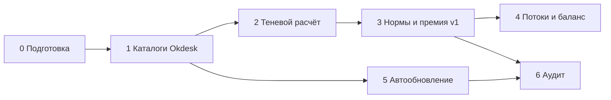

# Пошаговый план реализации нового подхода

План внедрения правил оценки заявок и премии (баллы из каталога, без свободного `ticket_weight`).  
Опирается на: `docs/00`–`15`, симуляции `analysis/bonus-comparison.*`, `analysis/mass-update-auto.*`.

**Курс (факт практики):** 1 балл = 15 ₽.  
**Две статьи премии:** обычные заявки / дежурство (`watch`) — раздельно.  
**Ограничение Okdesk:** без Expert 50+ нет автоправил «поле обязательно если…» → регламент + тип «Нестандарт» + отчёты.

---

## Карта фаз (обзор)

| Фаза | Срок (ориентир) | Результат | Выплаты меняются? |
|------|-----------------|-----------|-------------------|
| **0. Подготовка** | 1–2 нед | Утверждены списки, нормы-черновик, владельцы | Нет |
| **1. Каталоги в Okdesk** | 2–3 нед | Новые typical / solution / Нестандарт; «Другое» ещё живёт параллельно | Нет |
| **2. Теневой расчёт** | 4–6 нед | Еженедельный отчёт «факт vs норма» по людям и статьям | Нет (только показ) |
| **3. Нормы + премия v1** | 2–4 нед | Баллы из правил; свободный select отключён/заморожен | **Да** (с даты X) |
| **4. Потоки и баланс** | параллельно с 3 / следом | Сегменты; трек расследований; MFC-правила | Уточнение справедливости |
| **5. Автообновление** | отдельный трек | Раскатки ПО/НДС-кампании уходят с ручных заявок | Снижение ФОТ пакетов |
| **6. Аудит и v2** | постоянно | Флаги, надбавки, качество | Точечные корректировки |



---

## Фаза 0. Подготовка и согласование

**Цель:** закрыть развилки из `docs/open-questions.md`, чтобы не переделывать поля в Okdesk.

### Шаги

Рабочий лист с чекбоксами утверждения: **[18-phase0-decisions.md](18-phase0-decisions.md)**.  
Ревизия «было → станет» (для согласования): **[19-phase0-revision.md](19-phase0-revision.md)**.

| # | Действие | Кто | Артефакт |
|---|----------|-----|----------|
| 0.0 | Каркас полей: typical → база; **осложнение +15/+30** + текст; **выезд +60**; watch | Руководитель | `docs/02`, `docs/03`, `docs/18` §0.0 |
| 0.1 | Утвердить целевой список **typical** (слияния + блоки A/B/C раскаток/хвоста) | Руководитель + тимлиды | `docs/10`, `docs/18` §0.1 |
| 0.2 | Утвердить список **solution_method** | То же | `docs/13`, `docs/18` §0.2 |
| 0.3 | Зафиксировать базы: T5=5 / C15=15 / S30=30 и **база × N** | Руководитель | `docs/01` |
| 0.4 | Как задаём **N объектов**: атрибут + список в описании (рекомендация) | Руководитель + админ Okdesk | `docs/18` §0.4 |
| 0.5 | Список конвейерных клиентов/очередей (IFCM, MFC, …) | Руководитель | `docs/18` §0.5 |
| 0.6 | Список целевых по **расследованиям** | Руководитель | `docs/15`, `docs/18` §0.6 |
| 0.7 | ~~Границы выездов по зонам~~ → выезд **всегда +60**; зоны не для баллов | Руководитель | `docs/03` |
| 0.8 | Коммуникация команде: зачем меняем, тень 1–1.5 мес без резки выплат | Руководитель | Письмо / созвон |

**Критерий готовности фазы 0:** заполнен и утверждён `docs/18-phase0-decisions.md` + дата старта фазы 1.

---

## Фаза 1. Каталоги и типы в Okdesk (без смены формулы выплат)

**Цель:** инженеры начинают выбирать правильные пункты; старая премия ещё по `ticket_weight`.

### Шаги

| # | Действие | Детали |
|---|----------|--------|
| 1.1 | Ввести/переименовать пункты **typical** по `docs/10` | В т.ч. раскатка ПО; НДС-кампания; НДС точечный; банк-модуль; запуск/подготовка; фейл авто; сервис клиента; сжатые доступы |
| 1.2 | Ввести/сжать **solution_method** по `docs/13` | Катить **вместе** с typical |
| 1.3 | Тип заявки **«Нестандарт»** + атрибут «Суть» | `docs/12`; не для MFC-bulk |
| 1.4 | Атрибут **N объектов** (если решили в 0.4) | Показывать/требовать регламентом на пакетных typical |
| 1.5 | Параллель 1–2 недели: старые «Другое» ещё доступны | Обучение на живых заявках |
| 1.6 | Убрать «Другое» из typical и solution | После короткой параллели |
| 1.7 | Регламент MFC | Техbulk без баллов = норма; дневной компенсатор «МФС. Заявки, звонки»; KPI typical — без MFC-bulk (`docs/11`) |

**Критерий:** доля «Другое»/пусто на **не-MFC** падает; тимлиды принимают выборочный разбор 20–30 заявок.

---

## Фаза 2. Теневой расчёт (премия ещё по-старому)

**Цель:** все видят «какой была бы премия по нормам»; ловим перекосы до даты X.

### Шаги

| # | Действие | Детали |
|---|----------|--------|
| 2.1 | Еженедельно: `fetch` + `compare_bonus_models` + разбор HTML | `analysis/bonus-comparison.html` |
| 2.2 | Считать **две статьи**: обычные / дежурство | Как в легенде отчёта |
| 2.3 | Личный разбор топ-отклонений | Кому −/+, за счёт пакетов / норм C15 / хвоста |
| 2.4 | Сверить пакетные заявки: есть ли N и список объектов | Иначе донастройка регламента |
| 2.5 | Зафиксировать дату **X** перехода выплат на нормы | Не раньше 4 недель стабильного заполнения каталога |

**Критерий:** 4+ недели тени; нет сюрпризов «−50% без объяснения»; команда понимает правила N и дежурства.

---

## Фаза 3. Нормы баллов и премия v1 (дата X)

**Цель:** убрать свободную самооценку; платить по правилам.

### Формула v1

```
баллы_заявки =
  если выезд: 60 × (1|2)
  иначе: (база × N + осложнение 0|15|30) × (1|2)

премия_₽ = сумма_баллов × 15

статьи: Σ обычные  и  Σ дежурство  — отдельно
```

### Шаги

| # | Действие | Детали |
|---|----------|--------|
| 3.1 | Таблица маппинга typical → T5/C15/S30 (+ признак «пакетный») | В репо + памятка инженеру |
| 3.2 | Заморозить/сузить `ticket_weight` | Либо служебное поле «рассчитанные баллы», либо короткий select только нормам |
| 3.3 | Дежурство: источник истины — табель; `watch` сверять отчётом | `docs/04`; две статьи в отчёте премии |
| 3.4 | MFC: техbulk = 0; компенсатор = T5 × N техзаявок дня (или утверждённая ставка) | Не платить дважды |
| 3.5 | Пакеты: только `база × N` при видимом N | Аудит свободных 300–1000 без списка |
| 3.6 | Первый месяц на нормах: «мягкий» режим | Разбор спорных; возможна ручная корректировка по аудиту |
| 3.7 | Сегменты в отчёте (ещё без жёсткой формулы микса) | Конвейер / пул / расследования — отдельные колонки |

**Критерий:** с даты X выплаты идут от нормативных баллов; select «на глаз» не используется.

---

## Фаза 4. Потоки, SLA, баланс расследований

**Цель:** справедливость между конвейером и сложным разбором; не смешивать групповой SLA с личной премией.

### Шаги

| # | Действие | Документ |
|---|----------|----------|
| 4.1 | Очередь/группа «Расследования / сверки» + маршрут | `docs/15` |
| 4.2 | Typical: оперативный ЧЗ ≠ расследование отклонений ЧЗ; расхождения | `docs/10`, `15` |
| 4.3 | Полный «сложный» вес — целевым или после передачи | Регламент + еженедельный отчёт перехвата |
| 4.4 | SLA: группа ≠ человек | `docs/06` |
| 4.5 | Владелец пула на смену | `docs/05`, open-questions |

Можно начинать **параллельно** с фазой 2–3 (регламент), жёсткую премиальную логику — после стабилизации v1.

---

## Фаза 5. Автообновление (отдельный продуктовый трек)

**Цель:** убрать ручной объём раскаток ПО / НДС-кампаний из премии инженеров.

| # | Действие | Эффект (ориентир по выгрузке) |
|---|----------|------------------------------|
| 5.1 | Автоагент на типовые пакеты (спулер, лого, SDK, фронт/ЧЗ, НДС-конфиг кампаний) | Mass-контур ~15% фонда баллов |
| 5.2 | Успешная авто-раскатка — не в премию инженера | Базовый сценарий: −~0.3 млн ₽ / 6 мес |
| 5.3 | В премии остаётся typical «Автообновление: сбой / офлайн / доводка» (`× N`) | `docs/10` блок B |
| 5.4 | Пересчёт тени после выката агента | `scripts/analyze_mass_updates.py` |

Не блокирует фазы 1–3: typical для хвоста заводим **сразу** в фазе 1.

---

## Фаза 6. Аудит и развитие v2

| # | Действие | Документ |
|---|----------|----------|
| 6.1 | Флаги: пакет без N; высокий балл без признаков пакета; перехват расследований; перекос дежурства | `docs/08` |
| 6.2 | При необходимости: select типов `X_*` поверх/вместо свободного текста | `docs/02` |
| 6.3 | Качество / SLA-после-взятия как лёгкий коэффициент (опционально) | `docs/07` |
| 6.4 | Доля Нестандарт без MFC → донастройка typical | `docs/12` |

---

## Роли и ответственность

| Роль | Зона |
|------|------|
| Руководитель | Утверждение каталогов и норм; дата X; сегменты; список целевых |
| Тимлиды | Обучение; разбор тени; аудит пакетов и Нестандарт |
| Админ Okdesk | Поля, типы, списки, отчёты |
| Инженер | Typical / solution / N / выезд / честный watch |
| Владелец пула смены | Очередь группы, красный SLA |

---

## Риски и как закрываем

| Риск | Митигация |
|------|-----------|
| Резкое падение премии у «пакетчиков» | Тень + пакет = база×N (не срез до 1 штуки); автообновление планировать отдельно |
| Рост ФОТ из‑за C15 на консультациях | Тень покажет; при необходимости сузить маппинг |
| MFC техbulk начнут «набирать» баллы | Регламент: bulk = 0; только компенсатор |
| «Другое» переедет в Нестандарт пачками | Еженедельная доля Нестандарт; разбор Сути |
| Дежурство накрутят чекбоксом | Сверка с табелем; статья «дежурство» отдельно |
| Нет Expert → нет автообязательности N | Регламент + аудит + отчёт «пакет без N» |

---

## Ближайшие 10 рабочих дней (стартовый спринт)

1. Созвон утверждения: typical блок A/B + базы T5/C15/S30 + способ задания N.  
2. Черновик списков в Okdesk (ещё не выключая «Другое»).  
3. Тип «Нестандарт» + «Суть».  
4. Памятка инженеру на 1 страницу (формула, пакет × N, MFC, две статьи премии).  
5. Запуск еженедельного теневого HTML.  
6. Назначить дату X не раньше чем через 4 недели тени.

---

## Ссылки

| Тема | Файл |
|------|------|
| Принципы / нормы / выезд / дежурство | `docs/00`–`04` |
| Typical / solution / Нестандарт | `docs/10`, `13`, `12` |
| MFC и контуры | `docs/11` |
| Потоки / SLA / премия / аудит | `docs/05`–`08` |
| Расследования | `docs/15` |
| Симуляция премий | `analysis/bonus-comparison.html` |
| Автообновление | `analysis/mass-update-auto.html` |
| Открытые вопросы | `docs/open-questions.md` |
| Передача в соседний app | `docs/16-handoff-internal-app.md` |
